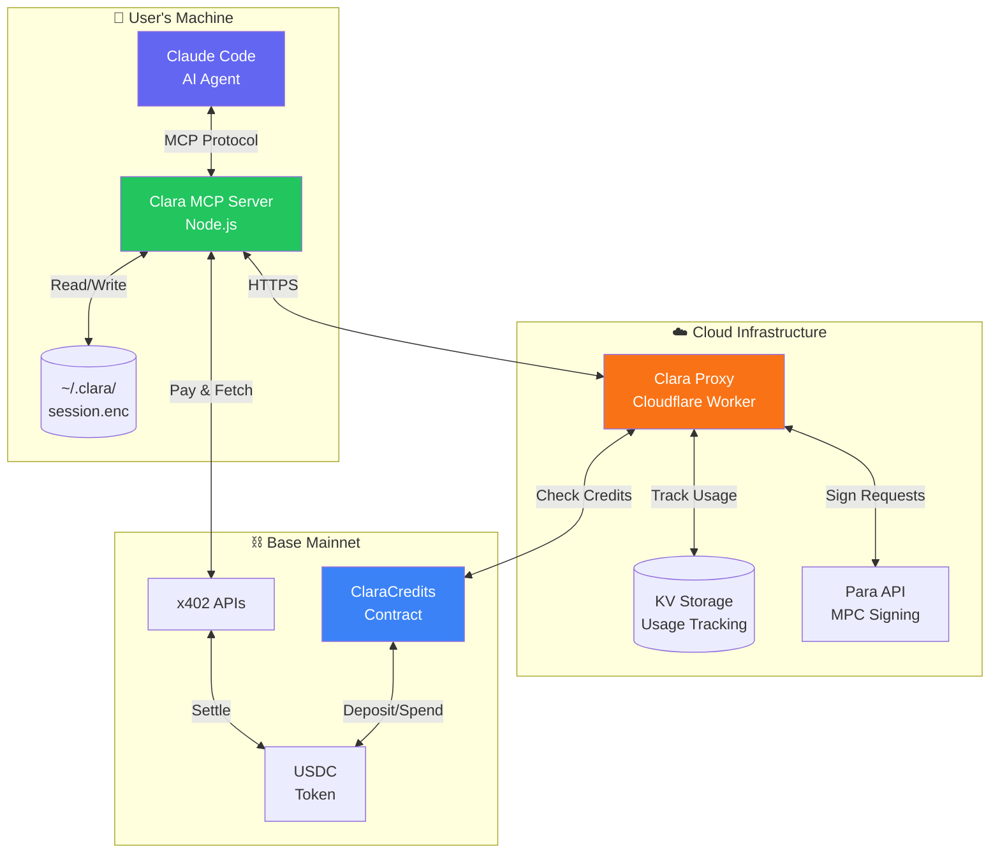
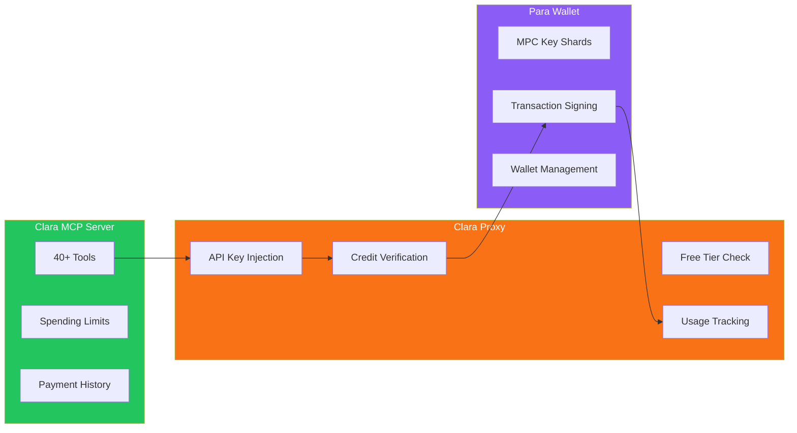
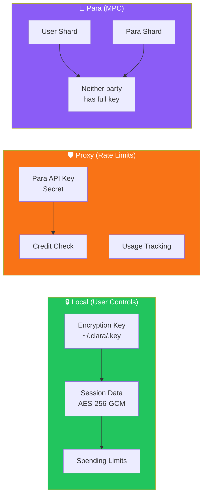
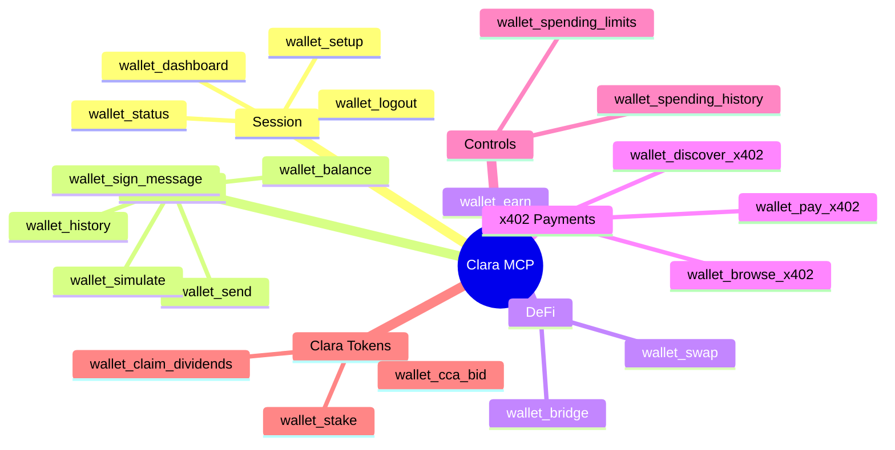

# Clara System Architecture

## High-Level Overview



## Component Responsibilities



## Data Flow: Sending a Transaction


## Credit System Flow

```mermaid
flowchart TD
    subgraph Bootstrap["🆓 Bootstrap (New Users)"]
        New[New User] --> Free{Free Tier<br/>< 1000 ops?}
        Free -->|Yes| Allow1[Allow Signing]
        Free -->|No| Check
    end

    subgraph Paid["💰 Paid Tier"]
        Check{Has On-Chain<br/>Credits?}
        Check -->|Yes| Allow2[Allow Signing]
        Check -->|No| Block[402: Deposit Required]
    end

    subgraph Settlement["📊 Settlement"]
        Allow1 --> Track1[Track in KV<br/>free:address]
        Allow2 --> Track2[Track in KV<br/>usage:address]
        Track2 --> Cron[Hourly Cron]
        Cron --> Spend[Call spend() on contract]
    end

    style Bootstrap fill:#22c55e,color:#fff
    style Paid fill:#3b82f6,color:#fff
    style Settlement fill:#f97316,color:#fff
```

## Security Model



## Tool Categories


