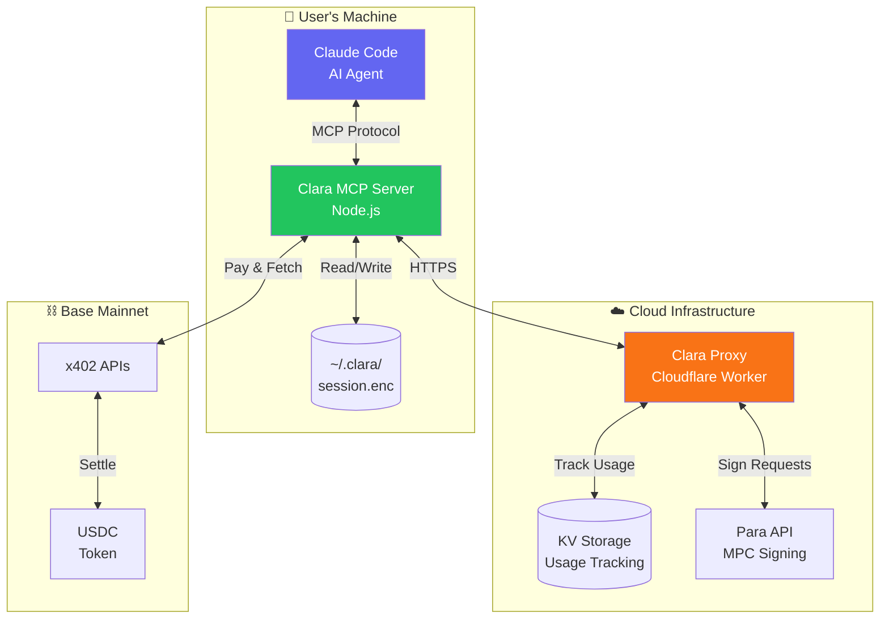
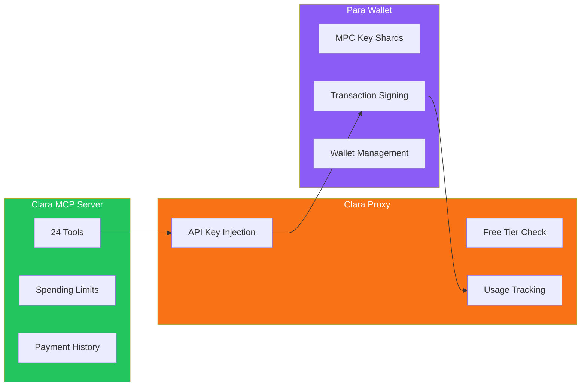
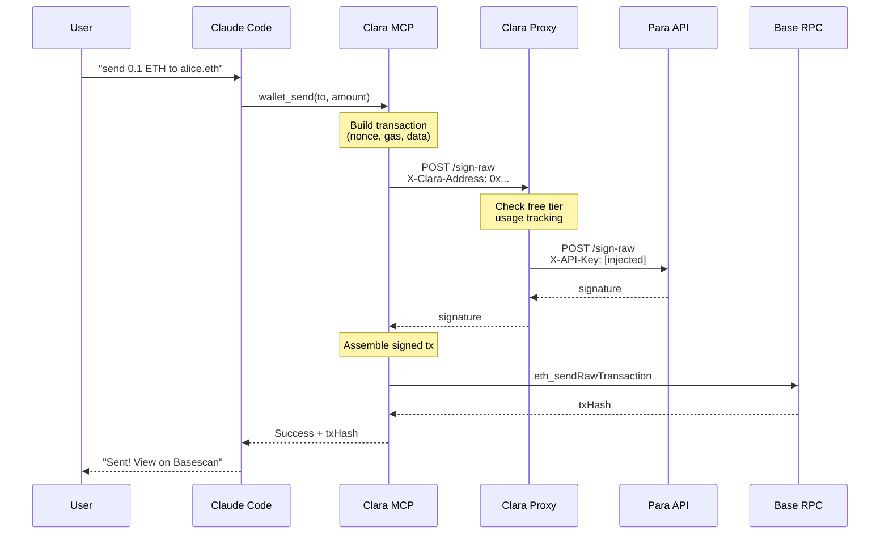
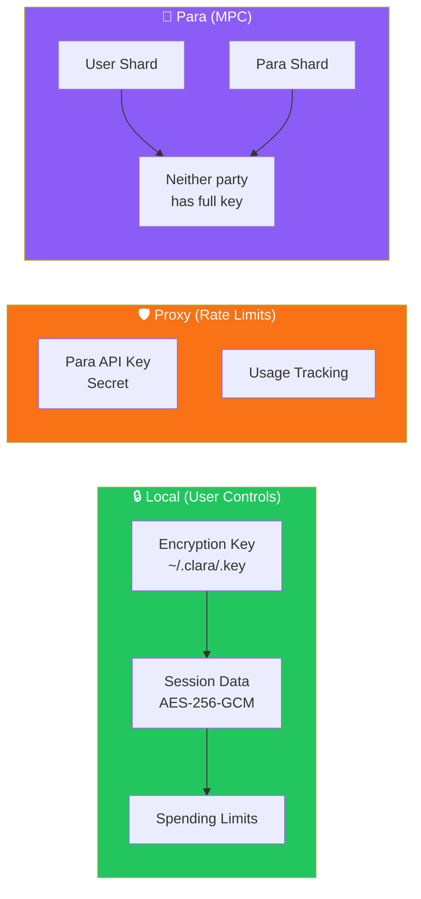
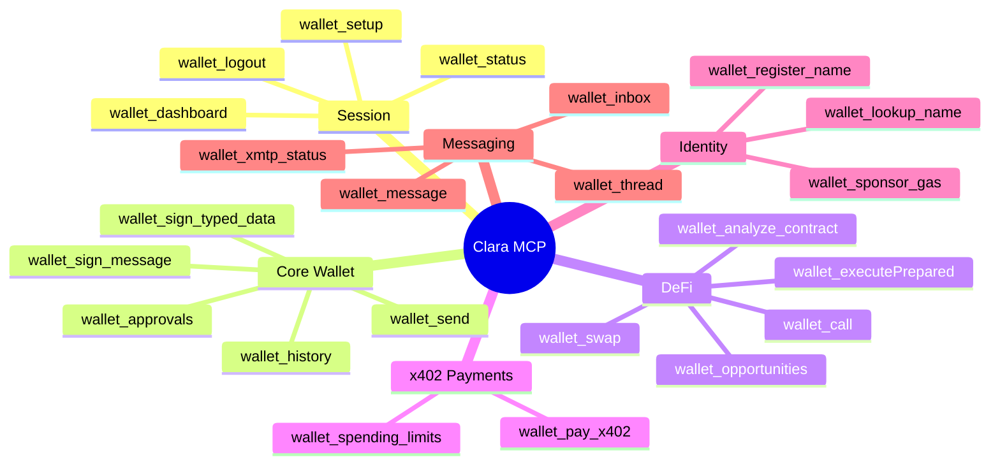

# Clara System Architecture

## High-Level Overview

```mermaid
flowchart TB
    subgraph User["👤 User's Machine"]
        CC[Claude Code<br/>AI Agent]
        MCP[Clara MCP Server<br/>Node.js]
        Session[(~/.clara/<br/>session.enc)]
    end

    subgraph Cloud["☁️ Cloud Infrastructure"]
        Proxy[Clara Proxy<br/>Cloudflare Worker]
        KV[(KV Storage<br/>Usage Tracking)]
        Para[Para API<br/>MPC Signing]
    end

    subgraph Chain["⛓️ Base Mainnet"]
        USDC[USDC<br/>Token]
        APIs[x402 APIs]
    end

    CC <-->|MCP Protocol| MCP
    MCP <-->|Read/Write| Session
    MCP <-->|HTTPS| Proxy
    Proxy <-->|Track Usage| KV
    Proxy <-->|Sign Requests| Para
    MCP <-->|Pay & Fetch| APIs
    APIs <-->|Settle| USDC

    style CC fill:#6366f1,color:#fff
    style MCP fill:#22c55e,color:#fff
    style Proxy fill:#f97316,color:#fff
```

## Component Responsibilities

```mermaid
flowchart LR
    subgraph MCP["Clara MCP Server"]
        Tools[24 Tools]
        Limits[Spending Limits]
        History[Payment History]
    end

    subgraph Proxy["Clara Proxy"]
        Auth[API Key Injection]
        Free[Free Tier Check]
        Track[Usage Tracking]
    end

    subgraph Para["Para Wallet"]
        MPC[MPC Key Shards]
        Sign[Transaction Signing]
        Wallet[Wallet Management]
    end

    Tools --> Auth
    Auth --> Sign
    Sign --> Track

    style MCP fill:#22c55e,color:#fff
    style Proxy fill:#f97316,color:#fff
    style Para fill:#8b5cf6,color:#fff
```

## Data Flow: Sending a Transaction

```mermaid
sequenceDiagram
    participant U as User
    participant C as Claude Code
    participant M as Clara MCP
    participant P as Clara Proxy
    participant A as Para API
    participant R as Base RPC

    U->>C: "send 0.1 ETH to alice.eth"
    C->>M: wallet_send(to, amount)

    Note over M: Build transaction<br/>(nonce, gas, data)

    M->>P: POST /sign-raw<br/>X-Clara-Address: 0x...

    Note over P: Check free tier<br/>usage tracking

    P->>A: POST /sign-raw<br/>X-API-Key: [injected]
    A-->>P: signature
    P-->>M: signature

    Note over M: Assemble signed tx

    M->>R: eth_sendRawTransaction
    R-->>M: txHash
    M-->>C: Success + txHash
    C-->>U: "Sent! View on Basescan"
```

## Security Model

```mermaid
flowchart LR
    subgraph Local["🔒 Local (User Controls)"]
        Key[Encryption Key<br/>~/.clara/.key]
        Session[Session Data<br/>AES-256-GCM]
        Limits[Spending Limits]
    end

    subgraph Proxy["🛡️ Proxy (Rate Limits)"]
        API[Para API Key<br/>Secret]
        Usage[Usage Tracking]
    end

    subgraph Para["🔐 Para (MPC)"]
        Shard1[User Shard]
        Shard2[Para Shard]
        Neither[Neither party<br/>has full key]
    end

    Key --> Session
    Session --> Limits
    Shard1 --> Neither
    Shard2 --> Neither

    style Local fill:#22c55e,color:#fff
    style Proxy fill:#f97316,color:#fff
    style Para fill:#8b5cf6,color:#fff
```

## Tool Categories

```mermaid
mindmap
  root((Clara MCP))
    Session
      wallet_setup
      wallet_status
      wallet_logout
      wallet_dashboard
    Core Wallet
      wallet_send
      wallet_sign_message
      wallet_sign_typed_data
      wallet_history
      wallet_approvals
    DeFi
      wallet_swap
      wallet_opportunities
      wallet_call
      wallet_executePrepared
      wallet_analyze_contract
    x402 Payments
      wallet_pay_x402
      wallet_spending_limits
    Identity
      wallet_register_name
      wallet_lookup_name
      wallet_sponsor_gas
    Messaging
      wallet_message
      wallet_inbox
      wallet_thread
      wallet_xmtp_status
```
