# x402 Protocol Architecture

## What is x402?

**x402** implements the HTTP 402 "Payment Required" status code for micropayments. It enables pay-per-request APIs without accounts, subscriptions, or API keys.

## Protocol Flow

## Payment Header Format

## EIP-712 Typed Data Structure

## Discovery Protocol

## Settlement Models

## Clara's x402 Implementation

## Security Features

```mermaid
flowchart LR
    subgraph Replay["🔄 Replay Protection"]
        N[Unique nonce per payment]
        D[Deadline limits validity]
        Ch[ChainId in domain]
    end

    subgraph Limits["💰 Spending Limits"]
        L1[Per-request: $1.00]
        L2[Per-day: $10.00]
        L3[Approval threshold: $0.50]
    end

    subgraph Verify["✅ Verification"]
        V1[Provider verifies signature]
        V2[Facilitator verifies again]
        V3[On-chain for disputes]
    end

    Replay --> Safe[Safe Payments]
    Limits --> Safe
    Verify --> Safe

    style Replay fill:#22c55e,color:#fff
    style Limits fill:#f97316,color:#fff
    style Verify fill:#3b82f6,color:#fff
```

## Benefits

## Full System Context

